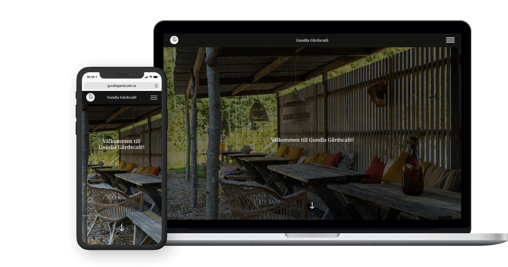

# **Gundla Gårdscafé**  [link](https://gundla.vercel.app/)

A project where webbdevlopers and Digital designers build a website for Gundla Gårdscafé for advertising them and a platform for displaying their events, food they server and catering.
Through the website you can also contact them through a specific form.
  
<br>

## **Installation** 
---------------
***1. Clone down the project to your computer:***

```
$ git clone https://github.com/emeliepetersson/gundla

```

***2. Change current directory to **gundla** directory and then install:***

```
npm install
# or
yarn install
```
***3. run local development server:***

```
npm run dev  
# or
yarn dev
```
***4. Open [http://localhost:3000](http://localhost:3000) with your browser to see the result.***

<br>

## **Build With**    

---------------
- [Next.js](https://nextjs.org/)
- [styled-components](https://styled-components.com/)
- [Contentful](https://www.contentful.com/) as headless cms
- [Vercel](https://vercel.com/) 
- [figma](https://www.figma.com/) design tool
- Javascript
- html/css
<br>

## **Authors**
---------------

### Web Developers
- [Andreas Pandzic](https://github.com/APandzic)
- [Emelie Petersson](https://github.com/emeliepetersson)
- [Marcus Augustsson](https://github.com/MarcusIsCode)

### Digital Designers
- Maja Saaranen
- Rebecka Wijk Fagerberg

## License
See [The MIT License](https://github.com/emeliepetersson/Gundla/blob/master/LICENSE).

 
